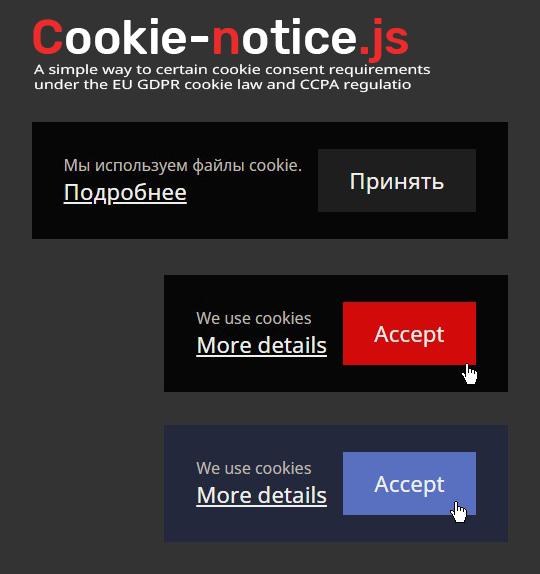

# Cookie-notice.js

A simple way to certain cookie consent requirements under the EU GDPR cookie law and CCPA regulations.
  
  
Just put this code in your index.html
```
<script type="text/javascript" src="cookie_notice.js"></script>
<script type="text/javascript">
	cookieNotice();
</script>
```
  
  
Wanna change config?
```
<script type="text/javascript" src="cookie_notice.js"></script>
<script type="text/javascript">
	cookieNotice({
		text: {
			we_use_cookies: "We use cookies",
			more_details: "More details",
			accept: "Accept"
		},
		more_details_url: "https://ec.europa.eu/info/cookies_en",
		colors: {
			background: rgb(6, 6, 6),
			text_we_use_cookies: rgb(190, 185, 175),
			text_more_details: rgb(240, 240, 235),
			text_accept: rgb(240, 240, 235),
			accept_button: rgb(30, 30, 30),
			accept_button_hovered: rgb(210, 10, 10),
		},
		parent_selector: "body"
	});
</script>
```
